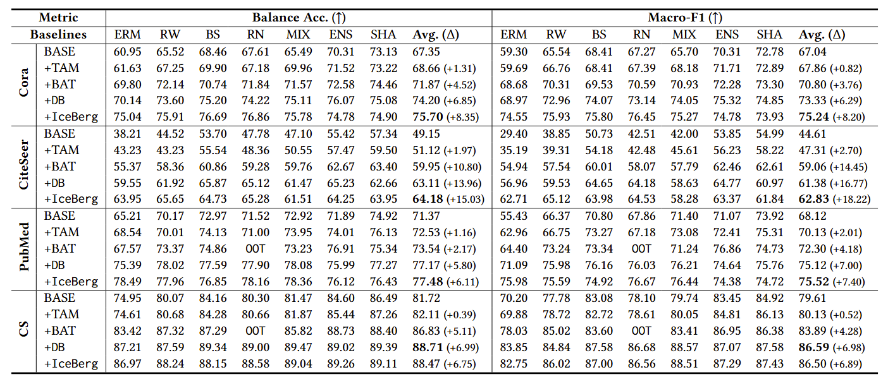
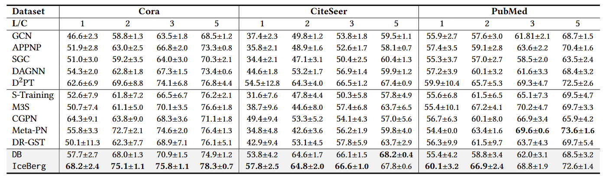

<h1 align="center"> ❄️ IceBerg: Debiased Self-Training for Class-Imbalanced Node Classification </a></h2>
<h5 align="center"> If you like our project, please give us a star ⭐ on GitHub for the latest update.</h5>

<h5 align="center">

    

</h5>

This is the official implementation of the following paper: 
> **IceBerg: Debiased Self-Training for Class-Imbalanced Node Classification (WWW'25)** [[Paper](https://arxiv.org/pdf/2502.06280)]
> 
> Zhixun Li, Dingshuo Chen, Tong Zhao, Daixin Wang, Hongrui Liu, Zhiqiang Zhang, Jun Zhou*, Jeffrey Xu Yu*

In this work, we propose IceBerg, a debiased self-training framework to address the class-imbalanced and few-shot challenges for GNNs at the same time. We find that leveraging unlabeled nodes can significantly enhance the performance of GNNs in class-imbalanced and few-shot scenarios, and even small, surgical modifications can lead to substantial performance improvements.

## 💫 Key Features

- **Plug-and-play**: Largely improve the performance of existing baselines as a plug-and-play module.
- **Simplicity**: You only need to add a few lines of code.
- **Versatility**: State-of-the-art performance in both class-imbalanced and few-shot node classification tasks.
- **Lightweight**: Achieve similar or even better efficiency compared to BASE balancing methods.


## 🚀 Get Start

This code needs the following requirements to be satisfied beforehand:
```
python>=3.9
torch==2.4.0
torch-geometric==2.6.1
ogb==1.3.6
scikit-learn==1.5.2
```

If you want to use our proposed Double Balancing, you only need to add the following lines of code:

```python
# Double Balancing
if not self.args.no_pseudo and epoch >= self.args.warmup:
    # Estimate pseudo class distribution
    self.class_num_list_u = torch.tensor([(self.pred_label[self.pseudo_mask] == i).sum().item() for i in range(self.num_cls)])
    # Unsupervised loss
    loss += criterion_u(output[self.pseudo_mask], self.pred_label[self.pseudo_mask], self.class_num_list_u) * self.args.lamda
```

If you want to try reproducing the baseline methods, simply run:

```
bash run_baseline.sh
```

If you want to try reproducing the performance of IceBerg, simply run:

```
bash run_iceberg.sh
```

## 🧰 Experimental Settings

We have incorporated several baseline methods and benchmark datasets:

| Baseline |Paper| Code |
| -------- |-| ---- |
| RW       |-| -    |
| BS       |[Balanced meta-softmax for long-tailed visual recognition](https://proceedings.neurips.cc/paper_files/paper/2020/file/2ba61cc3a8f44143e1f2f13b2b729ab3-Paper.pdf) | [BalancedSoftmax](https://github.com/jiawei-ren/BalancedMetaSoftmax-Classification) |
| RN       |[Topology-imbalance learning for semi-supervised node classification](https://proceedings.neurips.cc/paper/2021/file/fa7cdfad1a5aaf8370ebeda47a1ff1c3-Paper.pdf) | [ReNode](https://proceedings.neurips.cc/paper/2021/file/fa7cdfad1a5aaf8370ebeda47a1ff1c3-Paper.pdf) |
| MIX       |-| -    |
| ENS       |[Graphens: Neighbor-aware ego network synthesis for class-imbalanced node classification](https://openreview.net/pdf?id=MXEl7i-iru)| [GraphENS](https://github.com/JoonHyung-Park/GraphENS)    |
| SHA       |[Graphsha: Synthesizing harder samples for class-imbalanced node classification](https://arxiv.org/pdf/2306.09612)| [GraphSHA](https://github.com/wenzhilics/GraphSHA)    |
| TAM       |[TAM: topology-aware margin loss for class-imbalanced node classification](https://proceedings.mlr.press/v162/song22a/song22a.pdf)| [TAM](https://github.com/Jaeyun-Song/TAM)    |
| BAT       |[Class-Imbalanced Graph Learning without Class Rebalancing](https://openreview.net/pdf?id=pPnkpvBeZN)| [BAT](https://github.com/ZhiningLiu1998/BAT)    |

Statistic of benchmark datasets is as follows:

| Dataset      | Type        | #nodes  | #edges    | #features | #classes |
| ------------ | ----------- | ------- | --------- | --------- | -------- |
| Cora         | Homophily   | 2,708   | 10,556    | 1,433     | 7        |
| CiteSeer     | Homophily   | 3,327   | 9,104     | 3,703     | 6        |
| PubMed       | Homophily   | 19,717  | 88,648    | 500       | 3        |
| CS           | Homophily   | 18,333  | 163,788   | 6,805     | 15       |
| Physics      | Homophily   | 34,493  | 495,924   | 8,415     | 5        |
| ogbn-arxiv   | Homophily   | 169,343 | 1,116,243 | 128       | 40       |
| CoraFull     | Homophily   | 19,793  | 126,842   | 8,710     | 70       |
| Penn94       | Heterophily | 41,554  | 1,362,229 | 5         | 2        |
| Roman-Empire | Heterophily | 22,662  | 32,927    | 300       | 18       |


## ⚙️ Experimental Results

Our proposed DB and IceBerg are able to achieve significant improvements conbined with several BASE balancing methods.



Due to IceBerg's outstanding ability of leverage unsupervised signals, it also achieves state-of-the-art results in few-shot node classification scenarios.



## Acknowledgements

We acknowledge these excellent works for providing open-source code: [GraphENS](https://github.com/JoonHyung-Park/GraphENS), [GraphSHA](https://github.com/wenzhilics/GraphSHA), [TAM](https://github.com/Jaeyun-Song/TAM), [BAT](https://github.com/ZhiningLiu1998/BAT), [D2PT](https://github.com/yixinliu233/D2PT).


## 🤗 Citation
Please consider citing our work if you find it helpful:
```
@article{li2025iceberg,
  title={IceBerg: Debiased Self-Training for Class-Imbalanced Node Classification},
  author={Li, Zhixun and Chen, Dingshuo and Zhao, Tong and Wang, Daixin and Liu, Hongrui and Zhang, Zhiqiang and Zhou, Jun and Yu, Jeffrey Xu},
  journal={arXiv preprint arXiv:2502.06280},
  year={2025}
}
```